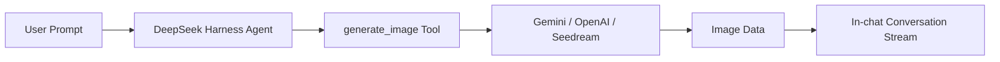

<div align="center">


<br /><br />

# 🎨 dsh-image-gen

**Bring ChatGPT-like image generation to DeepSeek Harness — supporting in-chat generation, gallery overview, fullscreen preview, quick copy, and one-click download.**

[](https://www.npmjs.com/package/dsh-image-gen)
[](https://github.com/deepseek-ai)
[](https://www.npmjs.com/package/dsh-image-gen)
[](LICENSE)

**English** | [简体中文](README.md)

<br />

<p align="center">💬 <b>Prompt your DeepSeek Harness Agent to install:</b></p>

```text
Install the image generation plugin by running: pnpm dsh plugin --profile web add dsh-image-gen@latest
```

<p align="center"><sub>(Or run manually in terminal: <code>pnpm dsh plugin --profile web add dsh-image-gen@latest</code>)</sub></p>

<br />

<p align="center">After installation, enter your API Key in DSH Settings, then tell the Agent:</p>

```text
Draw a cyberpunk cat on a neon street in a rainy night.
```

<p align="center">The Agent will automatically call <code>generate_image</code> and display the image directly in the conversation.</p>

<br />


</div>

---

## 💡 What Problem Does It Solve?

**`dsh-image-gen` is an open-source image generation plugin built specifically for DeepSeek Harness (DSH).**

DeepSeek Harness empowers agents to use tools for various tasks. This project adds native **multimodal image generation capabilities**:



---

## 🚀 Quick Install & Usage

### 1. Install Plugin

In your DeepSeek Harness workspace root:

```bash
# Recommended: Install or upgrade to latest release
pnpm dsh plugin --profile web add dsh-image-gen@latest

# If dsh is installed globally:
dsh plugin --profile web add dsh-image-gen@latest
```

<details>
<summary><b>🛠️ Alternative Installations (Git Repo / Local Dev)</b></summary>

```bash
# Method B: Install directly from GitHub
pnpm dsh plugin --profile web add git+https://github.com/shanliuling/dsh-image-gen.git

# Method C: Clone & install locally
git clone https://github.com/shanliuling/dsh-image-gen.git
pnpm dsh plugin --profile web add ./dsh-image-gen
```

</details>

### 2. Configure API Key

Open DSH Web (`http://localhost:3080`):

1. Navigate to **Settings → Plugins → Image generation**.
2. Select Provider, input API Key, click **Save**.

<div align="center">
  
</div>

### 3. Generate Images in Chat

Simply prompt in the chat input:

```text
Generate a minimalist modern architecture living room illustration.
```

The Agent will call `generate_image` and return the image directly in the conversation stream.

### 4. Browse Native Image Gallery

Click the **`[Gallery]`** Tab in the top navigation bar to browse and search all generated images across conversations:

<div align="center">
  
</div>

---

## ✨ Key Features

- 💬 **In-Chat Image Generation**: Tell your Agent what you want to draw without switching tabs or tools.
- 🖼️ **Native Image Gallery**: Dedicated "Gallery" tab automatically collecting all generated images with keyword search, provider filtering, and quick copy/download.
- 🔍 **Interactive Image Tools**: High-res fullscreen preview, one-click copy to clipboard, local download, and open in new tab.
- 🎨 **Multi-Provider Support**: Supports Google Gemini, OpenAI Images, OpenAI Compatible API, and ByteDance Seedream / Volcengine Ark.
- 🔑 **BYOK (Bring Your Own Key)**: Uses your own API keys managed securely by DSH credentials service with write-only protection.
- 🖼️ **Durable Session Persistence**: Images integrate with DSH Attachment and conversation lifecycle, preserved across reloads.
- 💾 **Workspace File Output**: By default each generated image is also written as a file into the current session workspace (`dsh-image-gen/` subfolder); the tool result carries the absolute file path. Can be disabled or re-pointed in settings.
- ⚙️ **Native Web Settings**: Configure providers, keys, models, and endpoints directly in DSH settings.

---

## 📦 Supported Providers

| Provider | Default Model | Default Endpoint / Base URL |
| :--- | :--- | :--- |
| **Google Gemini** | `gemini-3.1-flash-image` | `https://generativelanguage.googleapis.com/v1beta/interactions` |
| **OpenAI Images** | `gpt-image-2` | `https://api.openai.com/v1` |
| **OpenAI Compatible** | Custom | Custom Base URL |
| **ByteDance Seedream / Volcengine Ark** | `doubao-seedream-5-0-260128` | `https://ark.cn-beijing.volces.com/api/v3` |

---

## 🛠️ Local Development

```bash
git clone https://github.com/shanliuling/dsh-image-gen.git
cd dsh-image-gen

pnpm install
pnpm run typecheck
pnpm run test
pnpm run build

pnpm run pack:check
```

---

## 📄 License

Open-sourced under the [MIT License](LICENSE).

If this plugin helps you, feel free to give it a ⭐️ **Star**!
