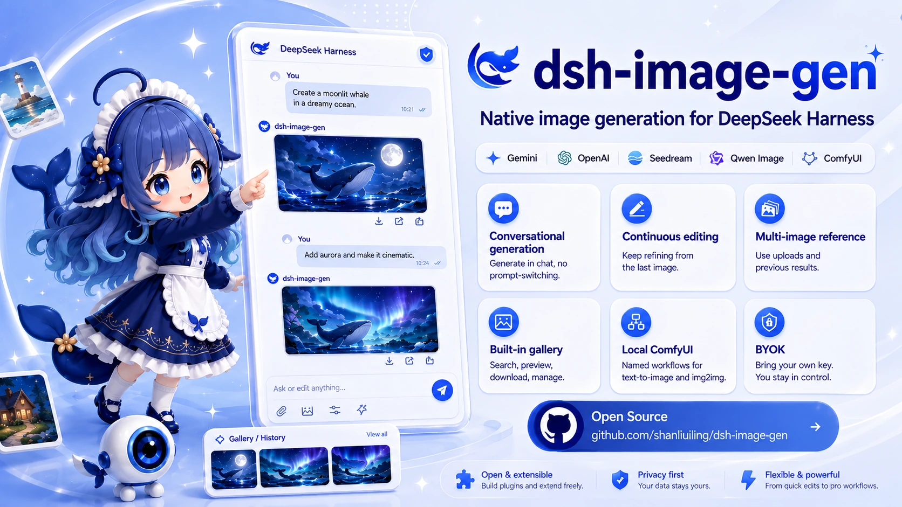
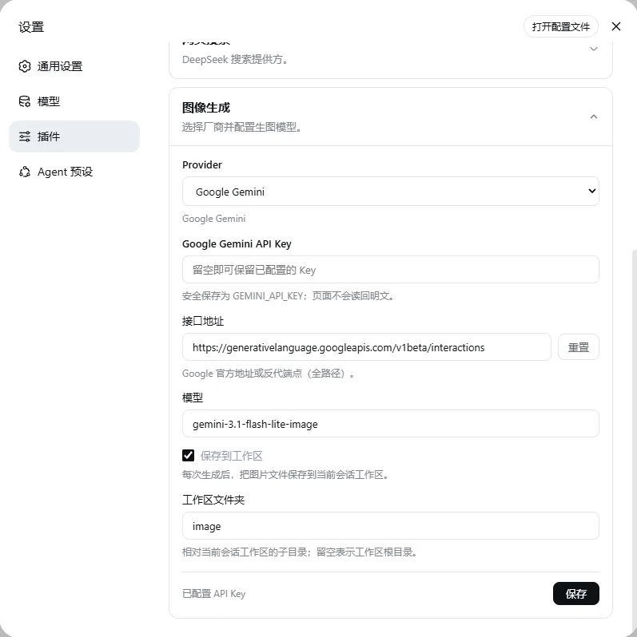
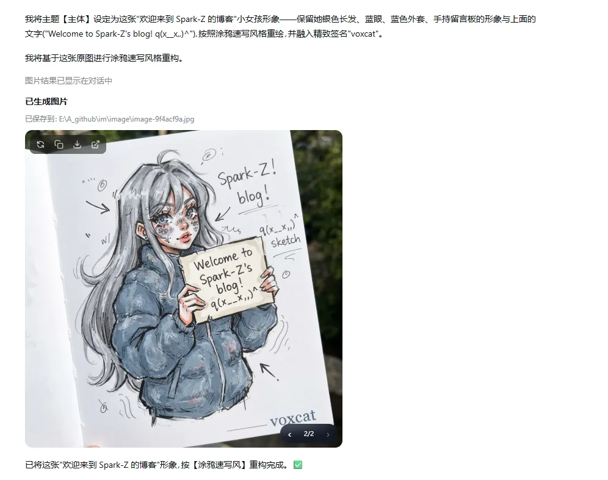
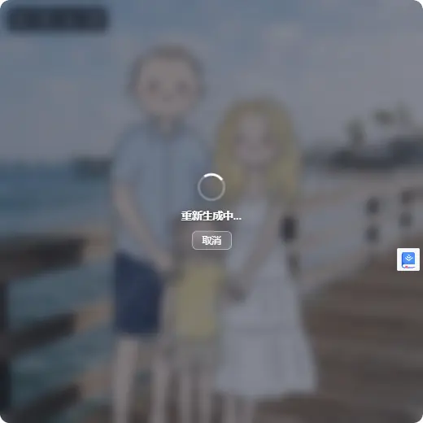
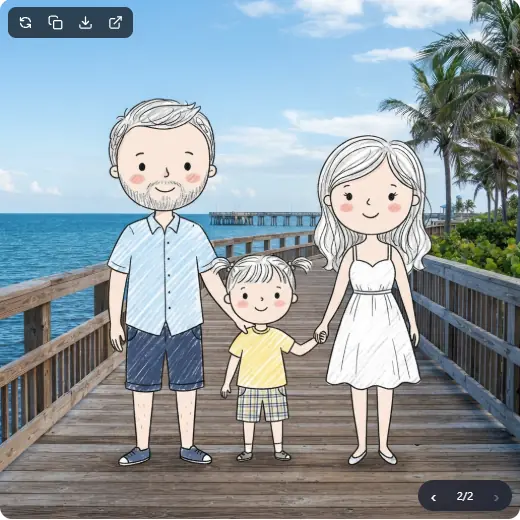
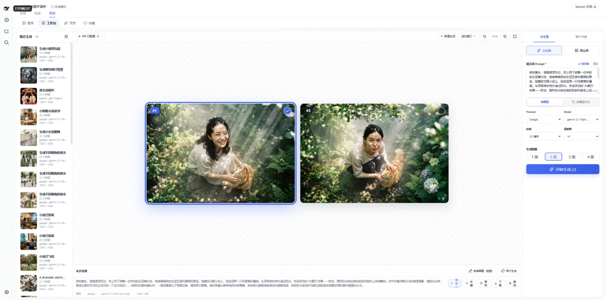
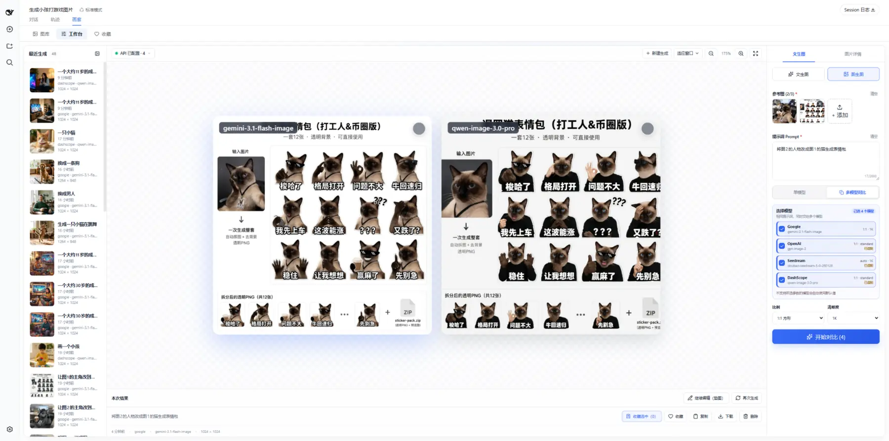
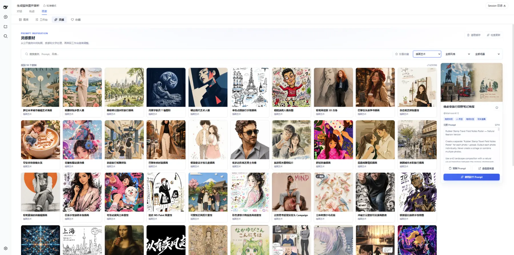
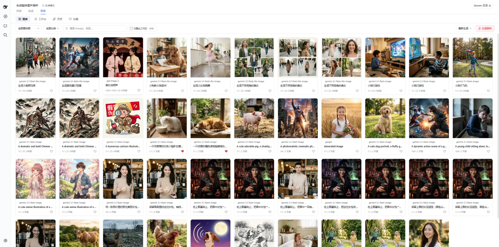
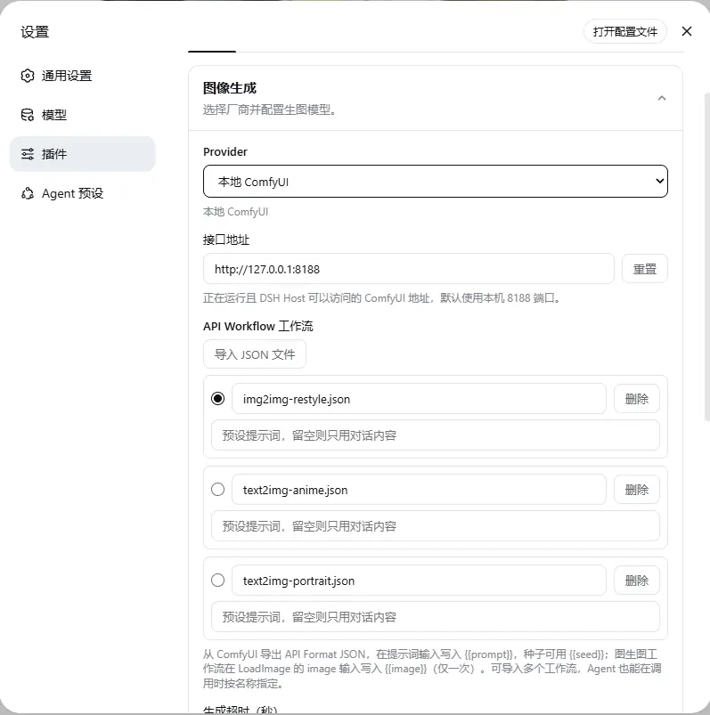

<div align="center">



<br />

<p><a href="README.md">简体中文</a> · <strong>English</strong></p>

# 🎨 dsh-image-gen

### Native AI image creation suite for DeepSeek Harness

<p><b>In-chat generation and editing · Studio batch creation · Multi-model comparison · 500+ prompt inspirations · Gallery management · Local ComfyUI</b></p>

<p>
  <a href="https://www.npmjs.com/package/dsh-image-gen"></a>
  <a href="https://www.npmjs.com/package/dsh-image-gen"></a>
  <a href="https://github.com/shanliuling/dsh-image-gen/actions/workflows/ci.yml"></a>
  <a href="https://github.com/shanliuling/dsh-image-gen/stargazers"></a>
  <a href="LICENSE"></a>
  <a href="https://linux.do/"></a>
</p>

<p>
  <a href="#quick-start">Quick Start</a> ·
  <a href="#core-capabilities">Core Capabilities</a> ·
  <a href="#provider-support">Provider Support</a> ·
  <a href="#faq">FAQ</a>
</p>

<br />

</div>

**A complete AI image creation workflow for DeepSeek Harness.**

`dsh-image-gen` goes far beyond basic in-chat image generation. It brings **continuous natural-language editing**, **Studio batch creation**, **side-by-side multi-model comparison**, a **500+ prompt inspiration library**, and **local ComfyUI** workflows into DSH. It supports **Google Gemini, OpenAI Images / Compatible, ByteDance Seedream, Aliyun DashScope**, and private local workflows. It uses a BYOK model and can isolate generated assets by workspace.

```bash
pnpm dsh plugin --profile web add dsh-image-gen@latest
```

---

## One plugin, four creative workflows

| Entry | Best for | What you can do |
| :--- | :--- | :--- |
| 💬 **Chat** | Letting the Agent understand natural-language requests | Text-to-image, image-to-image, multi-image reference, continuous editing, and in-place regeneration |
| 🎛️ **Studio** | Precise control over creation parameters | Generate 1–4 candidates, use up to 5 reference images, and pan or zoom the canvas |
| ✨ **Inspiration** | Finding compositions, styles, and prompts | Browse 500+ examples, search and filter, favorite, copy, or send a prompt to Studio |
| 🖼️ **Gallery** | Organizing and reusing generated results | Search, filter, favorite, regenerate, download, batch-manage, and isolate by workspace |

---

## Quick Start

### 1. Install the plugin

Requirements: DeepSeek Harness `>= 0.1.1-rc.2` and `< 0.2.0`; Node.js `^22.19.0` or `>= 24.0.0`.

Run this command from your DeepSeek Harness project root:

```bash
pnpm dsh plugin --profile web add dsh-image-gen@latest
```

> 💬 **Power-user tip:** You can also send this directly to the Agent in a DSH chat:<br />
> `Install the image generation plugin by running this command in the terminal: pnpm dsh plugin --profile web add dsh-image-gen@latest`

<details>
<summary><strong>Alternative installation methods (global / GitHub / local development)</strong></summary>

```bash
# If dsh is installed globally:
dsh plugin --profile web add dsh-image-gen@latest

# Install the latest source directly from GitHub:
pnpm dsh plugin --profile web add git+https://github.com/shanliuling/dsh-image-gen.git

# Clone the repository and install it for local development:
git clone https://github.com/shanliuling/dsh-image-gen.git
pnpm dsh plugin --profile web add ./dsh-image-gen
```

</details>

### 2. Configure a Provider

After restarting DSH, open:

**Settings → Plugins → Plugin Configuration → Image Generation**

Choose a Provider, enter your API key, and adjust the model, Endpoint / Base URL, and workspace-save options as needed. For ComfyUI, enter an address reachable by the DSH Host and import an **API Format Workflow JSON** file.

<br />

<div align="center">
  
  <br />
  <sub>Select a provider, configure API credentials, set model names, and adjust workspace save options.</sub>
</div>

<br />

### 3. Start creating

Describe the image you want directly in chat:

```text
Create a cinematic cyberpunk cat on a neon street at night, 16:9.
```

You can also upload a reference image directly for style transfer or editing:

```text
Keep the character and composition unchanged, then add black sunglasses to the cat.
```

<br />

<div align="center">
  
  <br />
  <sub>The Agent interprets visual prompts and renders generated images directly inside the conversation stream.</sub>
</div>

<br />

For more precise parameter control, open **Gallery** from the conversation header, then switch between **Gallery / Studio / Inspiration / Favorites**.

---

## Core Capabilities

### 💬 In-chat generation, editing, and revision switching

- The Agent automatically selects generation or editing based on your intent.
- Supports text-to-image, single-image editing, multi-image reference, image composition, and style transfer.
- Reference images can come from the current upload, earlier generated images in the conversation, or workspace files.
- Edit the prompt on an existing image card and regenerate asynchronously without adding duplicate messages.
- Old and new results stay on the same card, with a built-in revision switcher for comparison.

<br />

<div align="center">
  
  
  <br />
  <sub>Regenerate in place after editing the prompt, then switch between previous results on the same image card.</sub>
</div>

<br />

### 🎛️ Studio batch creation

- Switch quickly between text-to-image and image-to-image workflows.
- Upload or drag in reference images—up to 5 in most cases and up to 3 for DashScope.
- Control the Provider, model, aspect ratio, quality, and number of outputs.
- Generate 1–4 candidates concurrently; successful results are preserved even when another request fails or times out.
- Pan the canvas freely, zoom from 25% to 500%, fit to the viewport, or inspect results in fullscreen.
- Continue editing recent images and inspect their prompt, model, dimensions, and generation time.
- Save only selected results to the gallery and workspace to avoid unnecessary files.

<br />

<div align="center">
  
  <br />
  <sub>Import references, control parameters, generate batches, select results, and save—all within one Studio.</sub>
</div>

<br />

### ⚖️ Side-by-side multi-model comparison

Run the same prompt and reference images concurrently across multiple configured cloud Providers. A failure from one model does not discard successful results from the others. When a model does not support the chosen aspect ratio or quality, the plugin adapts the request to the nearest available option so you can compare styles and details directly.

<br />

<div align="center">
  
  <br />
  <sub>Compare results from different models on one canvas, then save the images you prefer in a batch.</sub>
</div>

<br />

### ✨ 500+ prompt inspiration examples

- Explore **500+ curated practical examples**, with precise filtering by keyword, category, style, and use case.
- Browse a masonry layout with lazy loading, infinite scrolling, and fullscreen image viewing.
- Favorite examples, copy complete prompts, or send a prompt to Studio for further refinement.
- Browser and host-disk caching with update checks, retry support, and cache cleanup.
- **Runs entirely from local cache after download; browsing and learning consume no tokens or generation quota.**

<br />

<div align="center">
  
  <br />
  <sub>Find inspiration first, then send a prompt to Studio. Browsing and copying from the local cache consume no generation quota.</sub>
</div>

<br />

### 🖼️ Gallery, favorites, and batch management

- Collect saved images from both chat and Studio.
- Filter or sort by Provider, aspect ratio, prompt keyword, and generation time.
- Use “Current workspace only” to isolate generated records between projects.
- Favorite, download, copy, continue editing, or regenerate images and prompts.
- Browse continuously in the lightbox using the mouse or `←` / `→` keys.
- Batch selection supports select all, invert, clear, and `Shift + click` range selection.
- When deleting a gallery record, optionally remove the associated local file after workspace-path validation.

<br />

<div align="center">
  
  <br />
  <sub>Filter, favorite, and batch-manage gallery items while keeping data isolated by workspace.</sub>
</div>

<br />

### 🧩 Multiple local ComfyUI workflows

Bring private image generation on your local GPU directly into Agent conversations. *(ComfyUI is currently available through Agent chat and is not yet integrated into Studio or multi-model comparison.)*

- Import **API Format Workflow JSON** exported by ComfyUI.
- Manage multiple named workflows and rename, delete, or choose a default workflow.
- Let the Agent select a workflow by name for the current request.
- Configure an independent prompt preset for each workflow.
- Supports the `{{prompt}}`, `{{seed}}`, and image-to-image `{{image}}` placeholders.
- Remains compatible with the legacy `%prompt%`, `%seed%`, and `%image%` syntax.
- Image-to-image workflows currently accept one source image per edit.

<br />

<div align="center">
  
  <br />
  <sub>Maintain independent workflows for different tasks and let the Agent select them precisely by name.</sub>
</div>

<br />

---

## Provider Support

| Provider | Chat generation | Chat editing | Studio | Multi-model comparison | Studio references |
| :--- | :---: | :---: | :---: | :---: | :---: |
| **Google Gemini** | ✅ | ✅ Multiple | ✅ | ✅ | Up to 5 |
| **OpenAI Images / Compatible** | ✅ | ✅ Multiple | ✅ | ✅ | Up to 5 |
| **ByteDance Seedream / Volcengine Ark** | ✅ | ✅ Multiple | ✅ | ✅ | Up to 5 |
| **Aliyun DashScope / Qwen Image** | ✅ | ✅ Multiple | ✅ | ✅ | Up to 3 |
| **Local ComfyUI** | ✅ | ✅ Single | — | — | 1 in chat editing |

> Studio and multi-model comparison currently support cloud Providers only. Multi-model comparison uses the model configured for each Provider in Settings.

<details>
<summary><strong>Current default models and endpoints (all configurable)</strong></summary>

| Provider | Default model | Default Endpoint / Base URL |
| :--- | :--- | :--- |
| Google Gemini | `gemini-3.1-flash-image` | `https://generativelanguage.googleapis.com/v1beta/interactions` |
| OpenAI Images | `gpt-image-2` | `https://api.openai.com/v1` |
| OpenAI Compatible | Custom | Custom Base URL |
| ByteDance Seedream | `doubao-seedream-5-0-260128` | `https://ark.cn-beijing.volces.com/api/v3` |
| Aliyun DashScope | `qwen-image-3.0` | `https://dashscope.aliyuncs.com/api/v1` |
| Local ComfyUI | Imported API Workflow | `http://127.0.0.1:8188` |

</details>

---

## Data and Privacy

- **BYOK:** API keys are stored through the DSH Credentials service and are never displayed in plaintext on the settings page.
- **Cloud requests:** The prompt and reference images used for a request are sent to the selected Provider. Follow that Provider's terms of service.
- **Local ComfyUI:** Requests are sent to the configured ComfyUI address.
- **Workspace files:** When workspace saving is enabled, chat results are written to disk; Studio saves only the candidates you select.
- **Gallery and favorites:** Gallery metadata and favorite state are stored in the current browser's local storage.
- **Inspiration cache:** Example metadata ships with the plugin. Images load on demand and are cached locally, and the cache can be cleared at any time.

## FAQ

<details>
<summary><strong>What should I do if “Image Generation” is missing after installation?</strong></summary>

Fully restart the current DSH Profile, then inspect the plugin configuration:

```bash
dsh --profile web --dump-config
```

If `dsh-image-gen` is absent from the output, run the installation command again. When filing an issue, include the DSH version, plugin version, and relevant error logs, but never include your API key.

</details>

<details>
<summary><strong>Where are generated images saved?</strong></summary>

When “Save to workspace” is enabled, chat results are saved to the `dsh-image-gen/` subdirectory of the current workspace by default. You can change this directory in Settings. Studio candidates remain on the temporary canvas until you select which results should enter the gallery and be saved.

</details>

<details>
<summary><strong>Why is ComfyUI not available in Studio?</strong></summary>

Studio and multi-model comparison currently support four cloud Provider families only. ComfyUI supports text-to-image, single-image editing, and multiple named workflows through Agent chat.

</details>

<details>
<summary><strong>Does deleting an item from the gallery remove its chat message?</strong></summary>

No. Deleting a gallery record does not modify the original chat message. You may separately choose to remove the corresponding local image file from the workspace. File deletion is normally irreversible, so confirm carefully.

</details>

<details>
<summary><strong>How do I upgrade?</strong></summary>

```bash
pnpm dsh plugin --profile web add dsh-image-gen@latest
```

Restart the corresponding DSH Profile after upgrading.

</details>

---

## Local Development

```bash
git clone https://github.com/shanliuling/dsh-image-gen.git
cd dsh-image-gen

pnpm install
pnpm run typecheck
pnpm test
pnpm run build
pnpm run pack:check
```

Feedback is welcome through [Issues](https://github.com/shanliuling/dsh-image-gen/issues). Read [CONTRIBUTING.md](CONTRIBUTING.md) before opening a Pull Request.

## License

This project is open source under the [MIT License](LICENSE).

<div align="center">

If `dsh-image-gen` improves your workflow, consider giving the project a ⭐ **Star** to support continued maintenance.

**[View Releases](https://github.com/shanliuling/dsh-image-gen/releases) · [Open an Issue](https://github.com/shanliuling/dsh-image-gen/issues) · [Contribute](CONTRIBUTING.md)**

</div>
